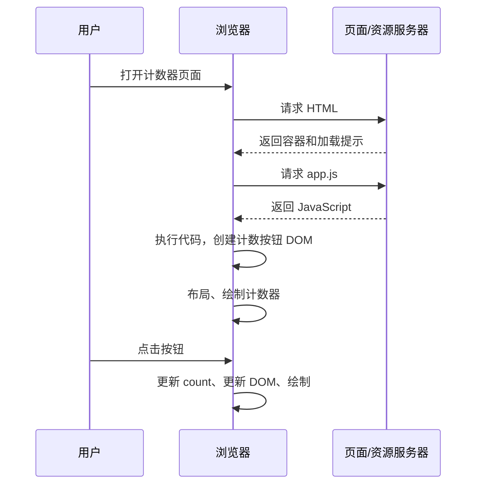

# CSR：客户端渲染

CSR（Client-Side Rendering，客户端渲染）是指在浏览器中执行 JavaScript，生成页面或页面某个区域的界面。

例如，HTML 最初只有一个容器，浏览器执行 JavaScript 后，在容器里创建一个显示“点击次数：0”的按钮。这就是一个简单的 CSR 例子。

理解 CSR，需要把三个问题分开：

1. 数据从哪里来？
2. 界面在哪里生成？
3. 用户什么时候看到内容、能够交互？

参考：[MDN：CSR](https://developer.mozilla.org/en-US/docs/Glossary/CSR)。

## 1. “客户端渲染”中的渲染指什么

SSR 页面最终也由浏览器画出来，为什么还叫“服务端渲染”？因为这里有两个层面的工作：

| 层面 | 具体工作 | 执行位置 |
| --- | --- | --- |
| 应用层的渲染 | 根据代码、数据和状态，决定页面里有哪些元素、显示什么内容 | 可以在服务端，也可以在浏览器 |
| 浏览器的渲染 | 根据 DOM 和样式，计算布局、绘制像素 | 浏览器 |

CSR、SSR 主要讨论第一层：界面在哪里生成。无论采用哪种方式，最后都需要浏览器完成样式计算、布局和绘制。

因此，判断 CSR 时，要观察的是：目标界面对应的 HTML 标记是否已经随响应到达，还是需要浏览器执行 JavaScript 后才生成？

参考：[MDN：浏览器如何工作](https://developer.mozilla.org/en-US/docs/Web/Performance/Guides/How_browsers_work)。

## 2. 一个完整的 CSR 例子

### 2.1 服务器返回页面入口

假设用户打开 `/counter`，服务器返回以下 HTML：

```html
<!doctype html>
<html lang="zh-CN">
  <head>
    <meta charset="UTF-8" />
    <title>计数器</title>
    <script src="/app.js" defer></script>
  </head>
  <body>
    <div id="root">正在加载……</div>
  </body>
</html>
```

这里有页面容器和加载提示，但没有计数按钮。这个例子说明，CSR 不一定一开始就是白屏：HTML 可以先提供静态提示或页面框架。

### 2.2 浏览器生成计数器

页面服务器提供的 `app.js` 内容如下，不需要数据接口：

```js
const root = document.getElementById("root");
let count = 0;
const button = document.createElement("button");

function updateText() {
  button.textContent = `点击次数：${count}`;
}

button.addEventListener("click", () => {
  count += 1;
  updateText();
});

updateText();
root.replaceChildren(button);
```

初始状态 `count = 0` 直接写在 JavaScript 中。`createElement()` 创建按钮，`textContent` 设置文字，`replaceChildren()` 把按钮放进页面。计数器界面在浏览器执行这些代码时生成。

### 2.3 首次访问和后续交互



点击次数保存在浏览器内存中的 `count` 变量里。点击改变 `count`，再修改按钮文字，没有请求服务器：

```text
用户操作 → 状态变化 → 界面更新 → 浏览器绘制
```

本例的初始生成和后续更新都在浏览器中完成。区分 CSR 与 SSR 首屏时，应当关注初始界面的生成位置；仅凭“点击后更新了界面”，不能判断首屏采用了哪种方式。

## 3. 与 SSR 对照：区分首屏与后续交互

仍然使用显示“点击次数：0”的按钮对照：

| 观察点 | 典型纯 CSR | 首屏采用 SSR |
| --- | --- | --- |
| 谁先生成计数按钮的初始界面 | 浏览器中的 JavaScript | 服务端 |
| 返回的 HTML | 容器、加载提示，尚无计数按钮 | 已包含 `<button>点击次数：0</button>` |
| 展示按钮是否依赖应用 JS | 通常依赖 | 已返回的按钮通常可以先展示 |
| 后续交互 | 浏览器处理 | 也可以由浏览器处理 |

SSR 也可能需要客户端 JavaScript。例如 React SSR 先给浏览器计数按钮的 HTML，再通过 hydration，让客户端 React 与已有 DOM 建立联系、管理状态和交互。对于这类已有服务端 HTML 的入口，React 使用 `hydrateRoot`。按钮已经显示，并不代表增加次数的交互逻辑已经就绪。

因此，“页面可以点击，而且点击以后局部更新，所以它是 CSR 页面”这个判断证据不足。SSR 页面完成 hydration 后，也能在浏览器里局部更新。应当分别描述：

```text
首屏内容：由服务端生成
后续交互：由客户端处理
```

渲染策略可以按阶段、按区域组合，不必给整站贴一个绝对标签。

参考：[React：hydrateRoot](https://react.dev/reference/react-dom/client/hydrateRoot)。

## 4. 为什么 CSR 经常有首屏等待

对于上面的计数器，按钮出现之前存在一条依赖链：

```text
拿到 HTML
→ 拿到并执行 JavaScript
→ 生成界面
→ 浏览器绘制
```

创建按钮的代码还没执行，计数按钮就不会生成。这种“前一步完成，后一步才能开始”的关系，是等待时间的重要来源。

如果界面还需要接口数据，并且代码在启动后才发起请求，那么依赖链中还会增加“请求数据 → 等待数据返回”。这是具体实现增加的依赖，不是 CSR 的必备步骤。

为了理解，假设这些阶段依次耗时：

```text
HTML：100ms
JS 下载：300ms
JS 执行：100ms
生成界面并绘制：50ms

计数器出现：约 550ms
```

这只是刻意简化的串行模型。真实页面中，资源下载可能重叠，缓存也会改变耗时。

用户可能早已看到“正在加载”，但还没看到计数按钮。首次出现内容、目标界面出现、界面能够及时响应操作，是不同的观察点。

## 5. 从机制推导收益与代价

应用启动后，代码和一部分状态已经在浏览器里。很多操作可以直接处理，页面之间也可以复用已加载的资源和数据。因此，对于持续使用、频繁交互的界面，这种方式往往很自然。

不过，仍要分别判断：

- 首次进入时，需要等待多少代码和数据？
- 启动完成后，操作响应是否及时？
- 低性能设备能否承担这些计算？
- 内容是否需要被搜索引擎或其他抓取工具直接读取？

这是从机制推导出的工程判断方法，而不是“CSR 一定适合某类网站”的固定规则。

SEO 不能简单说成“CSR 无法被收录”。Google 能执行 JavaScript，但依赖 JS 的内容需要经过渲染处理，资源访问和执行失败也可能影响内容获取；其他抓取工具未必有同样的能力。

因此，公开文档等需要稳定被读取的内容，通常更值得考虑提前生成 HTML；编辑器等需要频繁交互的界面，则可以更重视交互和客户端状态管理。

参考：[Google：JavaScript SEO 基础](https://developers.google.com/search/docs/crawling-indexing/javascript/javascript-seo-basics)。

## 6. 与 SPA、前后端分离、客户端取数的关系

这些概念回答的问题不同：

| 概念 | 它回答的问题 | 与 CSR 的关系 |
| --- | --- | --- |
| CSR | 界面在哪里生成？ | 在浏览器 |
| SPA（单页应用） | 页面切换是否主要在同一个文档内完成？ | 经常使用 CSR，也可以有 SSR 首屏 |
| 前后端分离 | 前后端如何划分职责、通过什么契约协作？ | 不决定界面一定在哪里生成 |
| 客户端请求数据 | 数据由谁发起请求？ | 是取数方式，不足以判断整页渲染策略 |

例如，服务端返回页面标题，浏览器执行 JavaScript 后再创建计数按钮：

```text
页面标题：服务端生成
计数按钮：客户端生成
```

因此，“看到 fetch 就判定整个页面是 CSR”容易出错。需要找到目标内容的生成过程。