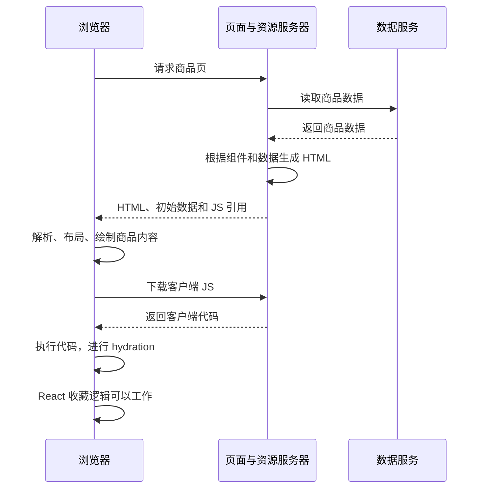

# SSR：服务端渲染

SSR（Server-Side Rendering，服务端渲染）是指服务器根据组件或模板和数据生成 HTML，再把 HTML 发给浏览器。

理解 SSR，需要始终区分三个问题：

1. 页面内容由谁生成？
2. 用户什么时候能看到内容？
3. 用户什么时候能操作页面？

SSR 主要改变初始页面结构的生成位置。内容显示还需要浏览器解析和绘制；依赖客户端 JavaScript 的交互，还需要相应代码执行。

下面用一个商品详情页串起完整流程。

## 1. “服务端渲染”中的渲染指什么

假设商品数据如下：

```js
const product = {
  id: "42",
  name: "机械键盘",
  price: 299,
};
```

组件描述页面结构：

```jsx
function ProductPage({ product }) {
  return (
    <main>
      <h1>{product.name}</h1>
      <p>{product.price + " 元"}</p>
    </main>
  );
}
```

它表达的是一个映射关系：

```text
组件或模板 + 数据 → 页面结构
```

SSR 让服务器执行这个映射，输出 HTML：

```html
<main>
  <h1>机械键盘</h1>
  <p>299 元</p>
</main>
```

服务器通常生成 HTML 标记，并没有替浏览器完成布局和绘制。SSR 把“根据组件和数据生成初始页面结构”提前到了服务器。

参考：[MDN：浏览器如何工作](https://developer.mozilla.org/en-US/docs/Web/Performance/Guides/How_browsers_work)。

## 2. SSR 的首次访问流程

```text
请求页面
  → 服务器读取商品数据
  → 服务器生成商品 HTML
  → 浏览器收到 HTML
  → 解析、布局、绘制商品内容
```

响应已经包含“机械键盘”和“299 元”，显示这些内容可以不依赖应用 JS 先执行完。实际显示时间仍受样式、资源和浏览器调度影响。

SSR 经常能改善首屏内容出现时间，原因是它改变了关键内容的依赖链：商品界面可以直接来自 HTML 响应。

参考：[web.dev：Web 渲染方式概述](https://web.dev/articles/rendering-on-the-web)。

## 3. Hydration 如何让 React 页面接上交互

把商品组件补充成一个带收藏按钮的页面：

```jsx
import { useState } from "react";

export default function ProductPage({ product }) {
  const [liked, setLiked] = useState(false);

  return (
    <main>
      <h1>{product.name}</h1>
      <p>{product.price + " 元"}</p>
      <button onClick={() => setLiked(value => !value)}>
        {liked ? "已收藏" : "收藏"}
      </button>
    </main>
  );
}
```

服务器生成的主体 HTML 等价于：

```html
<main>
  <h1>机械键盘</h1>
  <p>299 元</p>
  <button>收藏</button>
</main>
```

浏览器可以显示按钮，但这个 React 收藏逻辑还不能工作。这里需要回答的是：为什么 React SSR 不直接把 `onClick` 函数写进 HTML，让按钮立即可用？

函数代码当然可以发送给浏览器，例如 HTML 中的 `<button onclick="alert('你好')">打招呼</button>` 就可以执行浏览器提供的 `alert`。React SSR 的选择是输出按钮的 HTML，把组件和事件处理代码通过客户端 JS 提供，而不是把 `onClick` 函数直接写成 HTML 的 `onclick` 属性。

对这个收藏按钮来说，仅仅复制函数正文还不够：

```js
() => setLiked(value => !value)
```

它依赖所在作用域中的 `setLiked`，这就是闭包中的变量引用。`setLiked` 也不是一个浏览器现成的全局函数，而是 React 为对应组件创建的状态更新函数，关联着该组件的状态和更新机制。即使把上面的代码放进 HTML，浏览器也不知道 `setLiked` 从哪里来、该更新哪个组件，以及如何把更新反映到按钮文字上。把函数代码转成文本，不会自动把服务器内存中的闭包和 React 运行环境一起搬过去。

React 采用的交接方式是：客户端 JS 包含这个组件的代码，浏览器在 hydration（水合）过程中执行组件，创建浏览器自己的 `liked`、`setLiked` 和点击处理函数，并建立组件与已有 DOM 的关系。

```text
服务器执行组件 → 生成初始 HTML
浏览器下载客户端 JS → 启动 hydration
hydration 过程中执行组件 → 建立本地状态、事件处理函数，并接管已有 DOM
```

因此，浏览器最终获得了实现收藏逻辑的代码；点击时运行的函数是在浏览器中创建的，操作的是浏览器中的组件状态，并不是把服务器上的那个函数实例直接搬了过来。



图中展示的是逻辑关系。实际下载、解析、绘制和 hydration 可以交错进行，客户端资源也可以由 CDN 提供。

React 的 hydration 入口是 `hydrateRoot`：

```jsx
hydrateRoot(
  document.getElementById("root"),
  <ProductPage product={product} />
);
```

它让浏览器中的 React 接管已有 DOM，建立组件状态、DOM 和事件处理之间的关系。组件也会在浏览器中执行，因此 hydration 不只是“给 HTML 加几个监听器”。

还要区分原生 HTML 能力和框架交互：链接跳转、普通表单提交等能力可以不依赖 React hydration；这个例子中的收藏状态切换需要客户端 React。

SSR 本身不要求 hydration。传统服务器模板生成 HTML，再配合链接和表单，同样属于服务端渲染。

参考：[React：hydrateRoot](https://react.dev/reference/react-dom/client/hydrateRoot)。

## 4. 一个完整的 SSR 数据交接例子

### 4.1 服务器用过的数据不会自动出现在浏览器内存里

服务器拥有 `product`，不代表浏览器的 JavaScript 内存里也有同一个变量。两个运行环境之间需要明确传递数据。

下面展示核心代码，省略路由注册、服务启动和构建配置。假设组件代码经过 JSX 编译，浏览器入口打包为 `/client.js`。

服务器处理请求：

```jsx
import { renderToString } from "react-dom/server";
import ProductPage from "./ProductPage.js";

function handleProductRequest(req, res) {
  // 模拟本次请求从数据服务读取到的商品
  const product = {
    id: "42",
    name: "机械键盘",
    price: 299,
  };

  const html = renderToString(
    <ProductPage product={product} />
  );

  // 转义小于号，避免数据提前结束 script 标签
  const initialData = JSON.stringify(product)
    .replace(/</g, "\\u003c");

  res.setHeader("Content-Type", "text/html; charset=utf-8");
  res.end(`<!doctype html>
<html lang="zh-CN">
  <head>
    <meta charset="utf-8">
    <title>商品详情</title>
  </head>
  <body>
    <div id="root">${html}</div>
    <script id="initial-data" type="application/json">${initialData}</script>
    <script type="module" src="/client.js"></script>
  </body>
</html>`);
}
```

浏览器入口：

```jsx
import { hydrateRoot } from "react-dom/client";
import ProductPage from "./ProductPage.js";

const product = JSON.parse(
  document.getElementById("initial-data").textContent
);

hydrateRoot(
  document.getElementById("root"),
  <ProductPage product={product} />
);
```

### 4.2 响应中的三类内容各有用途

| 内容 | 用途 |
| --- | --- |
| 商品 HTML | 让浏览器先显示内容 |
| 初始商品数据 | 让客户端重建相同的初始界面 |
| 客户端 JS | 提供组件逻辑和后续交互 |

服务器传递的是可序列化的数据，而不是整个服务端运行环境。组件函数通过客户端代码提供；浏览器中的 `liked` 状态由 `useState(false)` 初始化。

## 5. 为什么两端首次输出必须一致

上面的服务器和浏览器首次渲染都使用：

```text
product = 同一份商品快照
liked = false
```

两端首次生成的界面一致，React 才能正确接管服务器生成的 DOM。

如果服务器生成的是“299 元”，浏览器在 hydration 前重新请求数据，拿到“319 元”，客户端预期的界面就和现有 HTML 不同了。这是 hydration mismatch（水合不匹配）的一种来源。

比较稳妥的数据交接流程是：

```text
服务器取得数据快照
  → 用快照生成 HTML
  → 把快照传给浏览器
  → 浏览器用相同快照完成首次渲染
  → 接管之后，再按业务需要刷新数据
```

“首次一致”和“后续更新”是两个阶段，不要求数据永远不变。

参考：[React：水合一致性要求](https://react.dev/reference/react-dom/client/hydrateRoot#caveats)。

## 6. SSR、CSR、SSG 与 SPA 的关系

### 6.1 区分生成位置和生成时机

| 方式 | 初始内容在哪里生成 | 什么时候生成 |
| --- | --- | --- |
| CSR | 浏览器 | 客户端代码运行时 |
| SSR | 服务器 | 通常在处理请求时 |
| SSG，静态站点生成 | 构建环境 | 提前生成，访问时直接发送 |

SSG 和 SSR 都可以让浏览器收到包含业务内容的 HTML，也都可以配合 hydration。它们的主要区别在生成时机。

SSR 页面也可以缓存。命中缓存时，本次访问可能直接拿到此前生成的 HTML，不必重新执行组件。因此不能把 SSR 理解为“每次请求都必然重新计算整页”。

参考：[Vue：SSR 与 SSG](https://vuejs.org/guide/scaling-up/ssr.html#ssr-vs-ssg)。

### 6.2 SSR 与 SPA 并不互斥

SSR 讨论初始页面内容如何生成。SPA（单页应用）主要讨论页面导航和更新如何组织。

一个应用可以采用这样的组合：

```text
首次直接访问：服务器生成 HTML
  → 浏览器完成 hydration
  → 后续状态变化由客户端更新
  → 站内导航由客户端路由处理
```

它也可以采用传统整页导航。具体行为取决于路由和应用实现，不能由“SSR”这个标签直接推出。

一次收藏点击通常不需要服务器重新生成整页：客户端可以更新状态，再调用接口保存结果。

## 7. 流式 SSR 解决什么问题

假设商品页的数据准备耗时如下：

```text
商品基本信息：100ms 就绪
用户评论：2000ms 就绪
```

如果服务器必须等全部内容完成再发送页面，评论就拖住了商品信息。

流式 SSR 可以先发送已经准备好的内容，再继续发送后续内容：

```text
先发送商品信息和评论加载提示
  → 浏览器可以先显示商品
  → 评论准备完成
  → 继续发送评论内容及更新所需的信息
```

React 的流式服务端渲染可以结合 `Suspense` 划分等待边界。数据读取方式也需要支持相应机制。

需要明确区分以下阶段：

```text
服务器生成了内容
≠ 内容已经传输完成
≠ 浏览器已经显示
≠ 对应区域已经完成 hydration
```

参考：[React：流式输出内容](https://react.dev/reference/react-dom/server/renderToPipeableStream#streaming-more-content-as-it-loads)。

## 8. SSR 的性能与 SEO 权衡

### 8.1 SSR 是否更快，需要看关键路径

下面的时间完全是假设，并且只计算所列串行阶段，用于理解依赖关系，不是性能实测：

```text
CSR：
HTML 外壳 50ms + JS 下载执行 500ms + 商品接口 200ms
→ 约 750ms 后具备生成商品界面的条件

SSR：
服务器取得商品 100ms + 生成 HTML 30ms + 传输 50ms
→ 约 180ms 后浏览器获得商品 HTML
```

这个假设下，SSR 可以更早交付商品内容。实际显示还需要浏览器处理 HTML、样式等工作。

如果服务器查询耗时 2 秒，而且发送 HTML 前一直等待，浏览器同样会等待很久。SSR 增加了服务端计算；完整 hydration 仍需要客户端下载并执行代码。

因此需要分别观察：

| 观察点 | 关注的问题 |
| --- | --- |
| 首字节到达时间，TTFB | 服务器和网络让用户等多久 |
| 主要内容显示时间，可结合 LCP | 用户何时看到页面的主要价值 |
| 客户端代码和接管过程 | 有哪些区域看起来可用，但应用逻辑仍未准备好 |
| 交互响应，可结合 INP | 用户操作后，页面能否及时响应 |

TTFB 快不能直接证明主要内容显示快，内容显示快也不能直接证明交互流畅。

传统完整 hydration 可能需要在两端都执行组件，并传递 HTML、初始数据和客户端代码；SSR 不自动意味着更少的 JS 或更少的总工作量。

参考：[web.dev：Web 渲染的性能权衡](https://web.dev/articles/rendering-on-the-web)。

### 8.2 SSR 可以降低爬虫对客户端执行的依赖

主要内容直接出现在 HTML 中，有助于爬虫读取页面，而不必依赖应用 JS 执行后才取得内容。

不过，Google 能执行 JavaScript，因此“CSR 无法被收录”并不准确。SSR 也不等于自动获得好的搜索排名，还需要正确处理内容、链接、元信息和响应状态等因素。

参考：[Google：JavaScript SEO 基础](https://developers.google.com/search/docs/crawling-indexing/javascript/javascript-seo-basics)。
