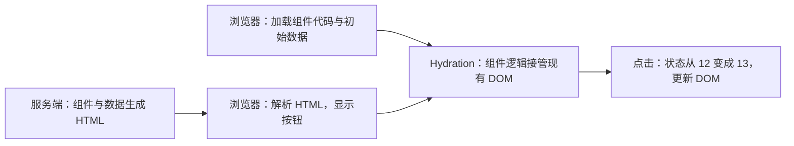

# Hydration：水合

Hydration（水合）是指浏览器中的框架接管已经生成的 HTML，建立组件、状态与 DOM 的对应关系，使页面能够响应框架提供的交互和状态更新。

理解 Hydration，需要区分三个阶段：

1. 初始界面已经生成。
2. 浏览器中的组件逻辑接管界面。
3. 用户交互或新数据触发后续更新。

SSR、SSG 可以提前完成初始 HTML 的生成；Hydration 完成客户端接管；接管后的状态变化属于普通客户端更新。页面已经显示，不代表框架交互已经就绪。

下面用一个点赞按钮串起完整流程。示例采用普通 React SSR；React Server Components 的区别在后文单独说明。

## 1. 为什么已经有 HTML，还需要 Hydration

假设服务端生成的按钮展示效果相当于：

```html
<button>点赞：12</button>
```

浏览器收到 HTML，就能解析、布局和绘制按钮。但这份 HTML 没有包含完整的组件运行逻辑：

- 数字属于哪个组件的状态。
- 点击后应该执行哪个函数。
- 状态变化如何触发组件更新。
- 更新后的组件应该修改哪个 DOM 节点。

同样的按钮 HTML，背后可能对应加一、打开登录框、发送请求等不同逻辑。从输出无法完整反推出产生输出的组件和行为。

因此，浏览器需要加载组件代码，在 Hydration 中执行组件，建立自己的组件树、状态和事件处理关系，并与现有 DOM 对应起来。

### 1.1 组件再次执行，不等于 DOM 全部重建

要区分两个动作：

| 动作 | 工作内容 |
| --- | --- |
| 执行组件的渲染逻辑 | 根据 props、state 等计算应该呈现的界面 |
| 创建或修改真实 DOM | 把界面结果落实到浏览器节点 |

Hydration 会执行组件的渲染逻辑，同时尝试复用已有 DOM。正常匹配时，不需要把整页 DOM 删掉重建。

组件逻辑重新建立，也意味着 Hydration 不只是给 HTML 加几个监听器。它需要把浏览器中的组件状态、更新机制、事件处理与 DOM 联系起来。

### 1.2 服务端实例不会自动搬到浏览器

服务端和浏览器是两个独立运行环境：

```text
服务端：执行组件，生成 HTML
浏览器：执行组件，建立自己的状态和事件处理函数
```

例如 `setLikes` 关联的是对应环境中的组件状态和更新机制。把事件函数正文变成文本，不会自动传递服务端内存里的闭包、组件实例和状态更新关系。

普通 React SSR 的交接方式是发送 HTML、必要的初始数据和客户端代码。客户端通过相同的初始输入建立自己的运行状态，而不是直接复活服务端的 JavaScript 对象。

### 1.3 水合前仍然可以有浏览器原生交互

尚未水合，不等于整个页面完全不能操作。链接跳转、输入框输入、普通表单提交等是浏览器提供的能力，可以不依赖 React。

尚未准备好的是依赖客户端框架逻辑的交互，例如下面例子中的点赞状态更新。


## 2. 一个完整的 React Hydration 例子

下面展示共享组件、服务端生成响应内容、客户端入口三个部分。省略 HTTP 服务器接线和构建配置，假设 JSX 已编译，浏览器入口打包为 `/client.js`。

### 2.1 服务端和客户端共享组件

```jsx
import { useState } from "react";

export default function App({ initialLikes }) {
  const [likes, setLikes] = useState(initialLikes);

  return (
    <button onClick={() => setLikes(value => value + 1)}>
      点赞：{likes}
    </button>
  );
}
```

`initialLikes` 是组件收到的初始数据。`likes` 是当前环境中这个组件的状态，`setLikes` 用来更新它。

服务端执行组件时，可以据此生成初始按钮 HTML；浏览器执行组件时，建立浏览器自己的状态与点击处理函数。

### 2.2 服务端生成 HTML，并传递初始数据

```jsx
import { renderToString } from "react-dom/server";
import App from "./App.js";

export function renderPage() {
  // 示例中用固定值模拟本次请求取得的数据
  const initialData = { likes: 12 };

  const appHTML = renderToString(
    <App initialLikes={initialData.likes} />
  );

  // 转义小于号，避免内嵌数据提前结束 script 标签
  const dataJSON = JSON.stringify(initialData)
    .replace(/</g, "\\u003c");

  return `<!doctype html>
<html lang="zh-CN">
  <head>
    <meta charset="utf-8">
    <title>点赞示例</title>
  </head>
  <body>
    <div id="root">${appHTML}</div>
    <script id="initial-data" type="application/json">${dataJSON}</script>
    <script type="module" src="/client.js"></script>
  </body>
</html>`;
}
```

`renderToString` 生成 HTML 字符串，不支持流式输出，适合这里用来说明最小流程。生产实现可以采用 React 的流式渲染 API。

响应中的三类内容各司其职：

| 内容 | 作用 |
| --- | --- |
| `appHTML` | 提供已经生成的按钮界面 |
| `initial-data` 中的 JSON | 让浏览器取得与服务端相同的初始数据 |
| `/client.js` 引用 | 让浏览器加载组件和运行时逻辑 |

`type="application/json"` 的脚本节点用来承载数据，不会把 JSON 当作 JavaScript 执行。客户端入口负责读取和解析它。

### 2.3 浏览器接管已有 DOM

```jsx
import { hydrateRoot } from "react-dom/client";
import App from "./App.js";

const initialData = JSON.parse(
  document.getElementById("initial-data").textContent
);

hydrateRoot(
  document.getElementById("root"),
  <App initialLikes={initialData.likes} />
);
```

浏览器读出 `12`，执行组件，计算出与服务端相同的初始界面，并让 React 接管根节点里的已有 DOM。

这里的初始状态来自明确传递的 JSON，不是 React 从按钮文字中自动推断出来的。



图中表示依赖关系。实际下载、解析、绘制和水合可以交错进行；内容显示时间还受样式、资源和浏览器调度影响。

### 2.4 接管之后进入普通客户端更新

| 阶段 | 状态来源 | 页面显示 |
| --- | --- | --- |
| 服务端渲染 | 本次请求取得的 `12` | 点赞：12 |
| 客户端首次渲染、水合 | 随页面传来的同一份 `12` | 点赞：12 |
| 水合后点击 | 浏览器中的状态更新 | 点赞：13 |

点击后，浏览器执行事件处理函数，`setLikes` 更新状态，React 再根据新的渲染结果更新 DOM。这个过程不需要重新调用 `hydrateRoot`。

## 3. Hydration 的一致性约定

Hydration 要求服务端生成的界面与客户端第一次渲染期望的界面一致，包括结构、文本和相关属性。这里的一致指渲染结果，不能简单理解为两个 HTML 字符串逐字比较。

可以把两次渲染抽象为：

```text
服务端：组件代码 + 服务端初始输入 → HTML → 浏览器解析后的 DOM
客户端：组件代码 + 客户端初始输入 → 期望接管的界面
```

组件代码相同，不代表结果一定相同。数据、时间、随机数、浏览器环境等输入不同，都可能导致 Hydration mismatch（水合不匹配）。

### 3.1 常见原因与处理思路

| 原因 | 为什么可能不一致 | 处理思路 |
| --- | --- | --- |
| 渲染时调用 `Date.now()` | 两端执行时间不同 | 传递同一个初始时间，或接管后更新 |
| 渲染时调用 `Math.random()` | 两次计算结果不同 | 传递同一个结果，或使用一致的种子 |
| 日期格式化依赖本地时区 | 两端时区可能不同 | 明确格式化规则，或接管后本地化 |
| 首次渲染读取 `localStorage` | 服务端没有浏览器存储 | 使用一致的初始值，再读取浏览器数据 |
| 根据 `window.innerWidth` 决定结构 | 两端环境信息不同 | 优先考虑 CSS 响应式，或接管后更新 |
| 两端首次渲染使用不同数据版本 | 初始数据快照不同 | 传递服务端使用的快照，再进行后续刷新 |
| 非法 HTML 嵌套 | 浏览器会纠正结构 | 修复 HTML 结构 |

例如 `<p><div>内容</div></p>` 会被浏览器纠正。水合面对的是已经解析出来的 DOM，所以即使服务端发送过这段文本，实际节点结构也可能偏离组件期望。

### 3.2 能在服务端执行，不代表能正确水合

下面的代码避免了服务端直接访问 `localStorage`，但两端仍然可能生成不同内容：

```jsx
function Greeting() {
  const name =
    typeof window === "undefined"
      ? "访客"
      : localStorage.getItem("name") ?? "访客";

  return <p>你好，{name}</p>;
}
```

如果浏览器存储着“张三”：

```text
服务端：你好，访客
客户端首次渲染：你好，张三
```

`typeof window` 解决了环境访问问题，却没有保证初始输出一致。

当某个值只能在浏览器取得时，可以先使用两端一致的初始值，再通过 Effect 更新：

```jsx
import { useEffect, useState } from "react";

function Greeting() {
  const [name, setName] = useState("访客");

  useEffect(() => {
    const savedName = localStorage.getItem("name");
    setName(savedName ?? "访客");
  }, []);

  return <p>你好，{name}</p>;
}
```

```text
服务端输出：访客
客户端首次渲染：访客
该组件水合提交后，Effect 读取存储：张三
普通状态更新：张三
```

Effect 不在服务端渲染期间执行，因此首次输出能够保持一致。这个 Effect 也不代表整页所有边界都已完成水合。

这种方式需要额外渲染，用户可能看到内容变化。如果服务端可以根据请求信息取得正确数据，可以直接传递相应的初始值。

### 3.3 一致性只约束交接起点

假设服务端渲染点赞数 `12`：

- 客户端首次渲染就期望 `13`：初始输出不一致。
- 客户端先用 `12` 接管，再收到新数据并更新为 `13`：正常客户端更新。

因此，实时数据可以变化，但需要区分“接管时的数据快照”和“接管后的刷新”。

React 要求把 mismatch 当作 bug 修复，也不保证修补所有属性差异。`suppressHydrationWarning` 只是有限的逃生口，不能替代数据和结构的一致性设计。

参考：[React：hydrateRoot 的一致性要求](https://react.dev/reference/react-dom/client/hydrateRoot#caveats)

## 4. 选择性水合

选择性水合是整体水合过程中的分区和调度机制：React 自动接管页面，Suspense 允许部分区域暂时跳过或独立等待，用户交互可以提高目标区域的优先级。

下面以 React 19.2 的正常初始水合为例，假设导航栏、侧栏和评论的服务端 HTML 已经显示，侧栏和评论分别位于 Suspense 边界内。

### 4.1 从整体水合到分区调度

调用 `hydrateRoot` 后，React 建立根节点和事件监听，开始渲染组件并关联现有 DOM。遇到 Suspense 时，它根据服务端 HTML 的边界标记建立边界 Fiber，记录对应 DOM，第一遍可以先跳过内部。

跳过的边界会留下待处理的 lane。根调度器根据优先级和阻塞状态选择工作，渲染循环沿必要的父路径进入目标边界，无关区域可以稍后处理。没有用户点击，这些工作也会自动推进。

水合与普通更新共用 Lane 调度体系，但不要求每个水合边界都创建一个与 `setState` 相同的 `Update` 对象。

一次实际的水合尝试是：

```text
取得组件函数 → 执行组件、建立客户端状态 → 得到 JSX
    → 建立内部节点并匹配已有 DOM
    → 关联 DOM、Fiber 和事件 props → 提交，完成接管
```

因此，组件代码加载完成只是一个前提，不等于区域已经完成水合。

### 4.2 挂起重试与交互优先级

React 在执行过程中发现依赖未就绪，就挂起本次尝试并注册通知：

- lazy 组件代码或 Suspense 数据未就绪：等待对应 Promise 完成。
- 流式 HTML 尚未到达：检查边界的 pending 状态，由流式运行时触发重试。

在正常初始水合路径中，已有服务端 HTML 可以继续显示，区域仍未水合；其他可推进工作可以继续。依赖完成后，React 标记相关工作可重试，再按优先级调度。通知只表示某个阻塞条件消失了，重试时仍可能遇到其他依赖。普通 `useEffect` 请求不会自动阻塞水合。

用户点击未水合区域时，根监听器根据目标 DOM 找到对应边界，登记高优先级工作，尝试同步水合。React 19.2 的这条路径使用 `SyncLane`：

- 当场成功：继续分发这次点击，执行对应的业务事件处理函数。
- 仍被依赖阻塞：阻止事件继续传播，保留较高的重试优先级，等待通知；不能保证这次点击以后重放。

优先级决定谁先被尝试，不能替代尚未就绪的依赖，也不能从任意位置打断正在执行的 JavaScript 函数。

下面是一种可能的时序：

| 阶段 | 工作与状态 |
| --- | --- |
| 启动 | 水合外层和导航栏，登记侧栏、评论边界 |
| 自动推进 | 按 lanes 尝试剩余边界的水合 |
| 点击评论 | 提高评论优先级并同步尝试，发现模块未就绪，挂起 |
| 等待期间 | 其他可推进工作继续，例如完成侧栏 |
| 模块就绪 | 通知 React，按此前记录的优先级重试评论 |
| 提交 | 评论组件执行、DOM 匹配成功，区域完成接管 |

没有点击，评论也会自动尝试和重试，只是没有交互带来的加急。

### 4.3 微任务与实际水合执行

依赖完成通知、根调度和实际渲染是不同环节：

```text
依赖完成 → Promise 回调通知 React（原生 Promise 回调是微任务）
    → 标记相关 lanes，确保根节点被调度
    → 根调度通常通过微任务检查工作
        ├─ 同步工作：可以直接执行
        └─ 并发工作：交给 Scheduler task，稍后推进渲染、水合
```

常见浏览器实现中，Scheduler 使用 MessageChannel 触发 task。已有调度可以复用，多个通知可以合并；并非每个区域就绪都创建一个独立微任务或 task。点击触发的同步水合还可以当场执行。